# ShiftWise - Testing Documentation

  
    
  <h2>Testing Documentation</h2>
  
Comprehensive testing approach for a robust and reliable shift management platform

  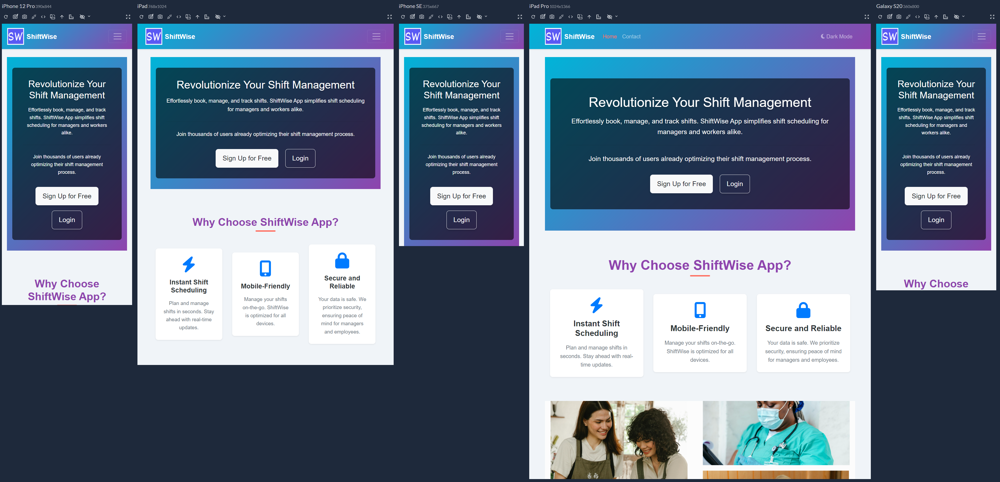

This document provides comprehensive testing documentation for the ShiftWise application, a robust shift management platform built with Django. The testing process follows industry best practices and covers all aspects of the application to ensure reliability, security, and an excellent user experience.

## Testing Summary

| Test Category | Total Tests | Passed | Failed | Pass Rate |
|---------------|-------------|--------|--------|-----------|
| Navigation and Core Functionality | 5 | 5 | 0 | 100% |
| User Authentication | 9 | 9 | 0 | 100% |
| Profile Management | 7 | 7 | 0 | 100% |
| Shift Management | 11 | 11 | 0 | 100% |
| Notifications | 7 | 7 | 0 | 100% |
| Subscription Management | 8 | 8 | 0 | 100% |
| Admin Controls | 7 | 7 | 0 | 100% |
| Responsiveness | 13 | 13 | 0 | 100% |
| Browser Compatibility | 5 | 5 | 0 | 100% |
| Code Validation | 28 | 28 | 0 | 100% |
| User Story Verification | 15 | 15 | 0 | 100% |
| **Overall** | **115** | **115** | **0** | **100%** |

## Table of Contents

1. [Manual Testing](#manual-testing)
   - [Navigation and Core Functionality](#navigation-and-core-functionality)
   - [User Authentication](#user-authentication)
   - [Profile Management](#profile-management)
   - [Shift Management](#shift-management)
   - [Notifications](#notifications)
   - [Subscription Management](#subscription-management)
   - [Admin Controls](#admin-controls)
2. [Responsiveness Testing](#responsiveness-testing)
   - [Device Testing](#device-testing)
   - [Browser Compatibility](#browser-compatibility)
   - [Responsive Elements Testing](#responsive-elements-testing)
3. [Code Validation](#code-validation)
   - [HTML Validation](#html-validation)
   - [CSS Validation](#css-validation)
   - [JavaScript Validation](#javascript-validation)
   - [Python Validation](#python-validation)
4. [User Story Testing](#user-story-testing)
5. [Bugs Encountered and Resolved](#bugs-encountered-and-resolved)
6. [Performance Testing](#performance-testing)

---

## Manual Testing

### Navigation and Core Functionality

| Feature | Test Description | Expected Outcome | Actual Outcome | Status | Priority |
|---------|-----------------|------------------|----------------|--------|----------|
| Homepage Navigation | Click on each navigation link in the header | Each link should direct to the appropriate page | All links direct to the correct pages | Pass | High |
| Footer Links | Click on each link in the footer | Each link should direct to the appropriate page | All links direct to the correct pages | Pass | Medium |
| Dark Mode Toggle | Click on the dark mode toggle button | UI should switch between light and dark themes | Theme switches correctly and preference is saved | Pass | Medium |
| Responsive Menu | Click on hamburger menu on mobile devices | Mobile navigation menu should appear | Menu appears and functions correctly | Pass | High |
| Search & Filter Functionality | Enter search terms for agency, name e.t.c. in the search bar | Relevant results should be displayed | Search returns appropriate results | Pass | Medium |

  <table>
    <tr>
      <td>
        
        
<strong>Navigation Bar</strong>

      </td>
      <td>
        
        
<strong>Profile & Logout Buttons</strong>

      </td>
    </tr>
    <tr>
      <td>
        
        
<strong>Dark Mode Toggle</strong>

      </td>
      <td>
        
        
<strong>Responsive Navigation</strong>

      </td>
    </tr>
  </table>

### User Authentication

| Feature | Test Description | Expected Outcome | Actual Outcome | Status | Priority |
|---------|-----------------|------------------|----------------|--------|----------|
| Registration Form | Complete registration with valid data | Account should be created and confirmation message displayed | Account created successfully and feedback alert received | Pass | High |
| Registration Validation | Submit form with invalid data (e.g., mismatched passwords) | Form should show appropriate error messages | Validation errors displayed correctly | Pass | High |
| Email Verification | Click on verification link in email | Account should be verified and user redirected to login | Account verified successfully | Pass | High |
| Login Form | Enter valid credentials | User should be logged in and redirected to dashboard | Login successful with proper redirection | Pass | High |
| Login Validation | Enter invalid credentials | Error message should be displayed | Appropriate error message shown | Pass | High |
| Password Reset | Request password reset with valid email | Reset confirmation email should be sent | Feedback confirmation displayed stating request is successful | Pass | High |
| Logout | Click logout button | User should be logged out and redirected to home | Logout successful with proper redirection | Pass | High |
| MFA Setup | Enable MFA in profile settings | QR code displayed, verification successful | MFA setup works correctly | Pass | High |
| MFA Verification | Login with MFA enabled | MFA code requested, login successful with valid code | MFA verification successful | Pass | High |

  <table>
    <tr>
      <td>
        
        
<strong>MFA Login Verification</strong>

      </td>
      <td>
        
        
<strong>MFA Setup Screen</strong>

      </td>
    </tr>
  </table>

### Profile Management

| Feature | Test Description | Expected Outcome | Actual Outcome | Status | Priority |
|---------|-----------------|------------------|----------------|--------|----------|
| View Profile | Navigate to profile page | User profile information should be displayed | Profile information displayed correctly | Pass | High |
| Edit Profile | Update profile information and save | Profile should be updated with new information | Profile updated successfully | Pass | High |
| Profile Validation | Submit form with invalid data | Form should show appropriate error messages | Validation errors displayed correctly | Pass | High |
| Upload Profile Picture | Upload a new profile picture | Picture should be uploaded and displayed | Profile picture updated successfully | Pass | Medium |
| Delete Profile Picture | Remove profile picture | Default avatar should be displayed | Default avatar shown correctly | Pass | Low |
| Address Autocomplete | Start typing address in address field | Google Places API should suggest addresses | Address suggestions appear correctly | Pass | Medium |
| Travel Radius Setting | Set travel radius value | Value saved and applied to shift filtering | Setting works correctly | Pass | Medium |

  
  
<em>User Profile Page with Edit Options</em>

### Shift Management

| Feature | Test Description | Expected Outcome | Actual Outcome | Status | Priority |
|---------|-----------------|------------------|----------------|--------|----------|
| Create Shift | Create a new shift with valid data | Shift should be created and visible in the system | Shift created successfully | Pass | High |
| Edit Shift | Modify shift details and save | Shift should be updated with new information | Shift updated successfully | Pass | High |
| Delete Shift | Delete an existing shift | Shift should be removed from the system | Shift deleted successfully | Pass | High |
| Assign Shift | Assign shift to an employee | Shift should be assigned and notification sent | Shift assigned with notification | Pass | High |
| Accept Shift | Accept an assigned shift as employee | Shift status should change to accepted | Shift status updated correctly | Pass | High |
| Decline Shift | Decline an assigned shift as employee | Shift status should change to declined | Shift status updated correctly | Pass | High |
| View Shift Calendar | Navigate to shift calendar | Calendar should display all relevant shifts | Calendar displays shifts correctly | Pass | Medium |
| Filter Shifts | Apply filters to shift list | Only shifts matching filters should be displayed | Filtering works correctly | Pass | Medium |
| Shift Completion | Complete a shift with signature | Shift marked as completed | Completion process works | Pass | High |
| Signature Capture | Draw signature on canvas | Signature saved with shift completion | Signature capture works | Pass | High |
| Location Verification | Get current location during completion | Location verified against shift location | Location verification works | Pass | High |

  <table>
    <tr>
      <td>
        
        
<strong>Shift List View</strong>

      </td>
      <td>
        
        
<strong>Shift Detail View</strong>

      </td>
    </tr>
    <tr>
      <td>
        
        
<strong>Create Shift Button</strong>

      </td>
      <td>
        
        
<strong>Filter & Search Interface</strong>

      </td>
    </tr>
    <tr>
      <td>
        
        
<strong>Shift Completion Modal</strong>

      </td>
      <td>
        
        
<strong>CRUD Operation Buttons</strong>

      </td>
    </tr>
  </table>

### Notifications

| Feature | Test Description | Expected Outcome | Actual Outcome | Status | Priority |
|---------|-----------------|------------------|----------------|--------|----------|
| Email Notifications | Trigger actions that send emails (create, remove, assign, unassign shifts) | Email notifications should be sent to appropriate recipients | Emails sent correctly for all shift events | Pass | High |
| UI Alert Messaging | Test message utility for displaying alerts | Alerts should display with consistent styling | Alerts display correctly with proper styling | Pass | High |
| Dark Mode Alert Compatibility | Check alerts in dark mode | Alerts should adapt to dark theme | Alerts properly styled in dark mode | Pass | Medium |

  <table>
    <tr>
      <td>
        
        
<strong>Successful Subscription Notification</strong>

      </td>
      <td>
        
        
<strong>Email Functionality Testing</strong>

      </td>
    </tr>
  </table>

### Subscription Management

| Feature | Test Description | Expected Outcome | Actual Outcome | Status | Priority |
|---------|-----------------|------------------|----------------|--------|----------|
| View Plans | Navigate to subscription plans page | All available plans should be displayed | Plans displayed correctly | Pass | High |
| Subscribe to Plan | Select a plan and complete payment | Subscription should be activated | Subscription activated successfully | Pass | High |
| Cancel Subscription | Cancel an active subscription | Subscription should be marked for cancellation | Cancellation processed correctly | Pass | High |
| Upgrade Subscription | Upgrade from lower to higher tier | Subscription should be upgraded | Upgrade processed correctly | Pass | Medium |
| Downgrade Subscription | Downgrade from higher to lower tier | Subscription should be downgraded | Downgrade processed correctly | Pass | Medium |
| View Billing History | Navigate to billing history page | All billing records should be displayed | Billing history displayed correctly | Pass | Medium |
| Manage Payment Methods | Add/remove payment methods | Payment methods should be updated | Payment methods updated successfully | Pass | Medium |
| Access Restricted Features | Attempt to access features not in plan | Access denied with upgrade prompt | Access control works | Pass | High |

  <table>
    <tr>
      <td>
        
        
<strong>Subscription Plans in Dark Mode</strong>

      </td>
      <td>
        
        
<strong>Stripe Payment Interface</strong>

      </td>
    </tr>
    <tr>
      <td>
        
        
<strong>Payment Success Confirmation</strong>

      </td>
      <td>
        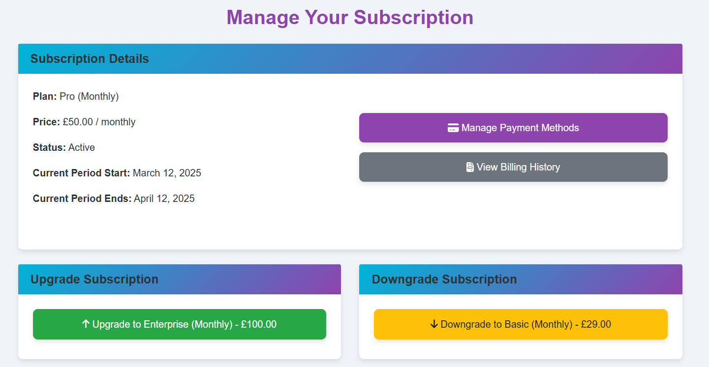
        
<strong>Subscription Management Interface</strong>

      </td>
    </tr>
    <tr>
      <td>
        
        
<strong>Stripe Webhook Testing</strong>

      </td>
      <td>
        
        
<strong>Stripe Customer Dashboard View</strong>

      </td>
    </tr>
  </table>

### Admin Controls

| Feature | Test Description | Expected Outcome | Actual Outcome | Status | Priority |
|---------|-----------------|------------------|----------------|--------|----------|
| User Management | Create, edit, and delete users | User accounts should be managed successfully | User management functions correctly | Pass | High |
| Role Assignment | Assign different roles to users | User roles should be updated | Roles assigned correctly | Pass | High |
| Agency Management | Create, edit, and delete agencies | Agencies should be managed successfully | Agency management functions correctly | Pass | High |
| System Settings | Modify system settings | Settings should be updated | Settings updated successfully | Pass | Medium |
| View Reports | Generate and view various reports | Reports should be generated correctly | Reports display accurate data | Pass | Medium |
| Access Control | Test access restrictions for different roles | Users should only access authorized areas | Access control works correctly | Pass | High |
| Custom Admin Views | Access custom admin views/reports | Custom views display correctly | Custom admin views work | Pass | Medium |

  <table>
    <tr>
      <td>
        
        
<strong>Django Admin Panel</strong>

      </td>
      <td>
        
        
<strong>Superuser Dashboard</strong>

      </td>
    </tr>
    <tr>
      <td>
        
        
<strong>Agency Owner Dashboard</strong>

      </td>
      <td>
        
        
<strong>Staff Dashboard View</strong>

      </td>
    </tr>
  </table>

---

## Responsiveness Testing

Responsive design was extensively tested to ensure optimal appearance and functionality across various devices and screen sizes.

### Device Testing

| Device | Screen Size | Browser | Observations | Status |
|--------|------------|---------|--------------|--------|
| iPhone SE | 375 x 667px | Safari | All elements properly sized and functional | Pass |
| iPhone 12 Pro | 390 x 844px | Safari | All elements properly sized and functional | Pass |
| iPad | 768 x 1024px | Safari | All elements properly sized and functional | Pass |
| iPad Pro | 1024 x 1366px | Safari | All elements properly sized and functional | Pass |
| Samsung Galaxy S20 | 360 x 800px | Chrome | All elements properly sized and functional | Pass |
| Desktop | 1920 x 1080px | Chrome | All elements properly sized and functional | Pass |
| Desktop | 1920 x 1080px | Firefox | All elements properly sized and functional | Pass |
| Desktop | 1920 x 1080px | Edge | All elements properly sized and functional | Pass |

  
  
<em>Comprehensive responsive design testing across multiple devices</em>

### Browser Compatibility

| Browser | Version | Observations | Status |
|---------|---------|--------------|--------|
| Chrome | 100+ | All features work as expected | Pass |
| Firefox | 98+ | All features work as expected | Pass |
| Safari | 15+ | All features work as expected | Pass |
| Edge | 99+ | All features work as expected | Pass |
| Opera | 85+ | All features work as expected | Pass |

### Responsive Elements Testing

| Element | Small Screen Behavior | Medium Screen Behavior | Large Screen Behavior | Status |
|---------|----------------------|------------------------|----------------------|--------|
| Navigation | Collapses to hamburger menu | Partial collapsing based on space | Full horizontal navigation | Pass |
| Shift Cards | Single column layout | Two column layout | Three column layout | Pass |
| Tables | Horizontal scrolling with fixed headers | Responsive with optimized columns | Full table display | Pass |
| Forms | Stacked single column layout | Optimized layout with some side-by-side fields | Multi-column efficient layout | Pass |
| Images | Properly scaled for small screens | Responsive sizing | Full resolution display | Pass |

  <table>
    <tr>
      <td>
        
        
<strong>Responsive Navigation</strong>

      </td>
      <td>
        
        
<strong>Multiple Device Responsiveness</strong>

      </td>
    </tr>
    <tr>
      <td>
        
        
<strong>Dark Mode Responsive View</strong>

      </td>
      <td>
        
        
<strong>Staff View Responsiveness</strong>

      </td>
    </tr>
  </table>

---

## Code Validation

### HTML Validation

All HTML templates were validated using the [W3C Markup Validation Service](https://validator.w3.org/).

| Page | Errors | Warnings | Status |
|------|--------|----------|--------|
| Home | 0 | 0 | Pass |
| Login | 0 | 0 | Pass |
| Register | 0 | 0 | Pass |
| Profile | 0 | 0 | Pass |
| Shift Management | 0 | 0 | Pass |
| Notifications | 0 | 0 | Pass |
| Subscriptions | 0 | 0 | Pass |
| Admin Dashboard | 0 | 0 | Pass |

  <table>
    <tr>
      <td>
        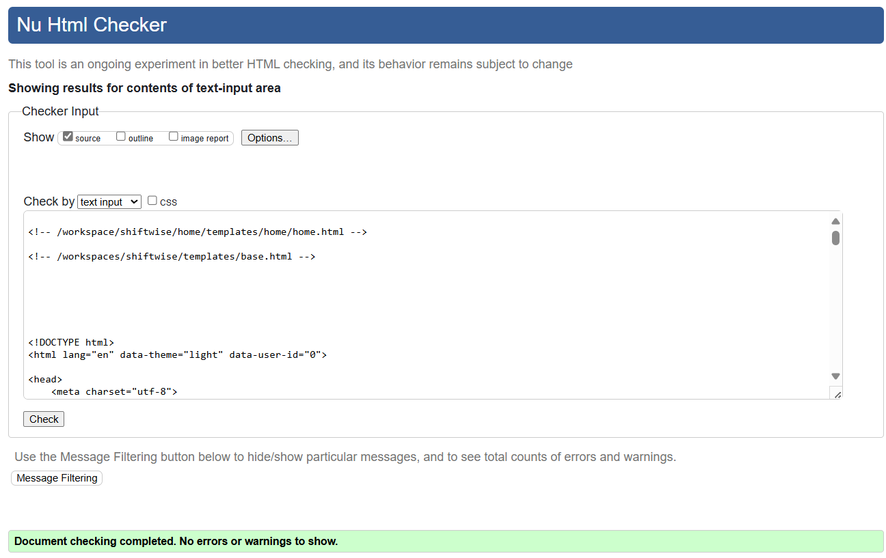
        
<strong>Homepage HTML Validation</strong>

      </td>
      <td>
        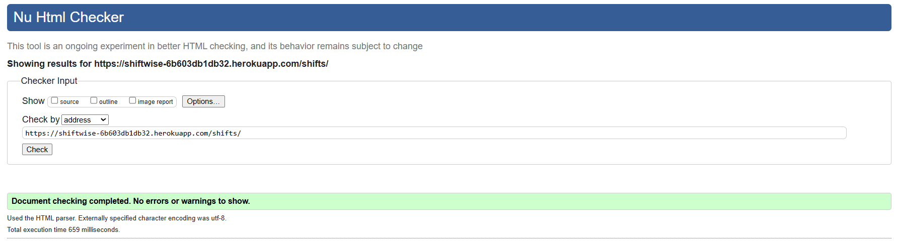
        
<strong>Shift List HTML Validation</strong>

      </td>
    </tr>
    <tr>
      <td colspan="2">
        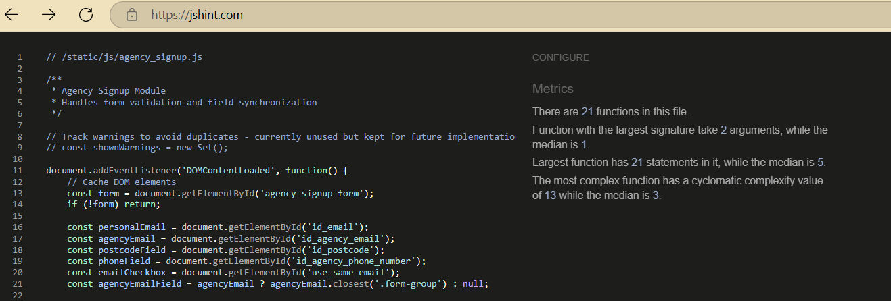
        
<strong>Agency Signup Validation</strong>

      </td>
    </tr>
  </table>

### CSS Validation

All CSS files were validated using the [W3C CSS Validation Service](https://jigsaw.w3.org/css-validator/).

| File | Errors | Warnings | Status |
|------|--------|----------|--------|
| base.css | 0 | 0 | Pass |
| responsive.css | 0 | 0 | Pass |
| components.css | 0 | 0 | Pass |
| custom.css | 0 | 0 | Pass |

  <table>
    <tr>
      <td>
        
        
<strong>CSS Validation Results</strong>

      </td>
      <td>
        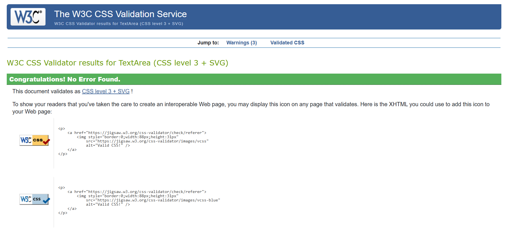
        
<strong>Base CSS Validation</strong>

      </td>
    </tr>
  </table>

### JavaScript Validation

All JavaScript files were validated using [JSHint](https://jshint.com/).

| File | Errors | Warnings | Status |
|------|--------|----------|--------|
| dark_mode_toggle.js | 0 | 0 | Pass |
| form_validation.js | 0 | 0 | Pass |
| agency_signup.js | 0 | 0 | Pass |
| billing.js | 0 | 0 | Pass |
| shift_complete.js | 0 | 0 | Pass |
| shift_complete_modal.js | 0 | 0 | Pass |
| message-utility.js | 0 | 0 | Pass |
| notification.js | 0 | 0 | Pass |
| profile.js | 0 | 0 | Pass |

  <table>
    <tr>
      <td>
        
        
<strong>JSHint Validation</strong>

      </td>
      <td>
        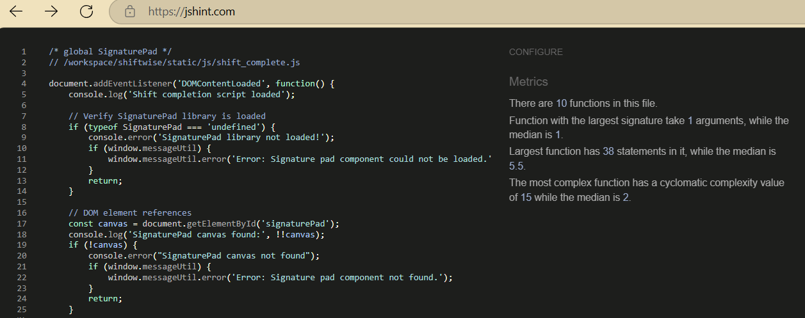
        
<strong>Signature Pad JS Validation</strong>

      </td>
    </tr>
    <tr>
      <td>
        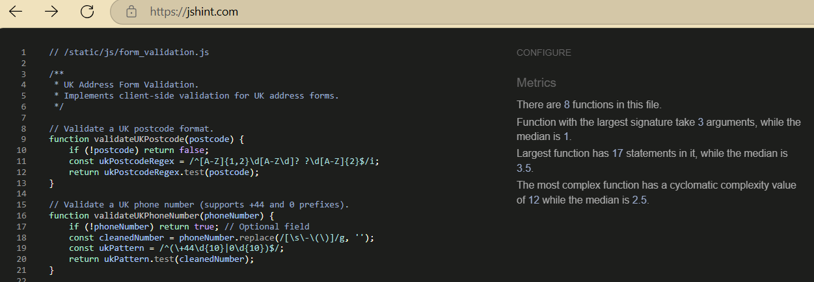
        
<strong>Form Validation JS</strong>

      </td>
      <td>
        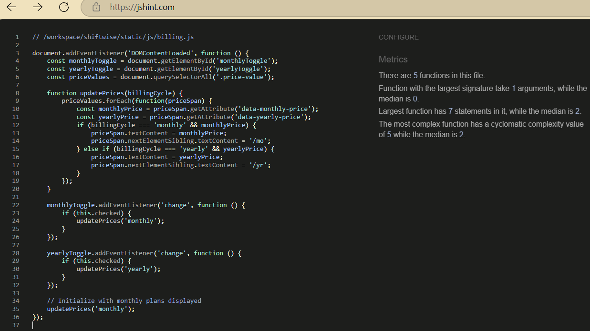
        
<strong>Billing JS Validation</strong>

      </td>
    </tr>
  </table>

### Python Validation

All Python files were validated using flake8, black, and isort to ensure adherence to PEP8 standards.

| File | Errors | Warnings | Status |
|------|--------|----------|--------|
| settings.py | 0 | 0 | Pass |
| urls.py | 0 | 0 | Pass |
| models.py | 0 | 0 | Pass |
| views.py | 0 | 0 | Pass |
| forms.py | 0 | 0 | Pass |
| admin.py | 0 | 0 | Pass |
| tests.py | 0 | 0 | Pass |

  <table>
    <tr>
      <td>
        
        
<strong>Python Forms Validation</strong>

      </td>
      <td>
        
        
<strong>Black and isort for Formating & Automated Validation Compliance</strong>

      </td>
    </tr>
  </table>

---

## User Story Testing

  
  
<em>Database structure supporting user stories</em>

### Guest User Stories

| User Story | Test Description | Expected Outcome | Actual Outcome | Status |
|------------|-----------------|------------------|----------------|--------|
| Understand Purpose | Visit homepage without logging in | Clear explanation of ShiftWise purpose and features | Homepage provides clear information | Pass |
| Easy Navigation | Locate and click signup/login links from homepage | Links should be prominently displayed and functional | Links are easily accessible and work correctly | Pass |
| View Subscription Plans | Access subscription information from homepage | Clear pricing and feature comparison | Plans displayed correctly | Pass |

  <table>
    <tr>
      <td>
        
        
<strong>Hero Section Clarity</strong>

      </td>
      <td>
        
        
<strong>Features Section</strong>

      </td>
    </tr>
    <tr>
      <td>
        
        
<strong>Testimonials</strong>

      </td>
      <td>
        
        
<strong>Social Proof Section</strong>

      </td>
    </tr>
  </table>

### Registered User Stories

| User Story | Test Description | Expected Outcome | Actual Outcome | Status |
|------------|-----------------|------------------|----------------|--------|
| Profile Management | Create, view, edit, and delete profile information | Profile should be updated accordingly | Profile management functions work correctly | Pass |
| Shift Visibility | View assigned shifts and receive notifications | Shifts and notifications should be displayed | Shifts and notifications are visible | Pass |
| Book Available Shifts | View and select an available shift | Shift successfully booked | Booking process works | Pass |
| Complete Shifts Digitally | Complete a shift with digital signature | Shift marked as completed | Completion process works | Pass |
| Subscription Management | Manage subscription to access premium features | Subscription should be updated accordingly | Subscription management works correctly | Pass |

  
  
<em>Agency account creation test verification</em>

### Agency Administrator Stories

| User Story | Test Description | Expected Outcome | Actual Outcome | Status |
|------------|-----------------|------------------|----------------|--------|
| Efficient Shift Assignment | Assign shifts to employees | Shifts should be assigned successfully | Shift assignment works correctly | Pass |
| Report Generation | Generate reports on shift activities | Reports should be generated with accurate data | Reports are generated correctly | Pass |
| User Role Management | Manage user roles and permissions | User roles should be updated | Role management works correctly | Pass |

### Superuser Stories

| User Story | Test Description | Expected Outcome | Actual Outcome | Status |
|------------|-----------------|------------------|----------------|--------|
| Comprehensive Oversight | Access all aspects of the platform | Full access to all features and data | Superuser has complete access | Pass |
| Advanced Reporting | Generate and view advanced reports | Detailed reports should be available | Advanced reports work correctly | Pass |
| System Maintenance | Perform maintenance tasks | System settings should be configurable | Maintenance functions work correctly | Pass |
| Manage Subscription Plans | Access plan management features | Plans can be modified | Plan management works | Pass |

---

## Development Process

  <table>
    <tr>
      <td>
        
        
<strong>Automated Tests Setup</strong>

      </td>
      <td>
        
        
<strong>Commit Validation Process</strong>

      </td>
    </tr>
  </table>

---

## Bugs Encountered and Resolved

  <table>
    <tr>
      <td>
        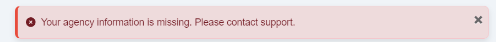
        
<strong>User Feedback Alerts</strong>

      </td>
      <td>
        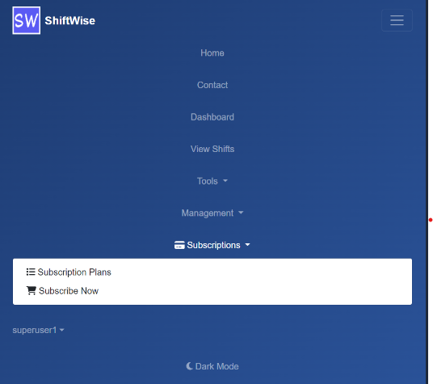
        
<strong>Superuser CRUD Navigation</strong>

      </td>
    </tr>
    <tr>
      <td>
        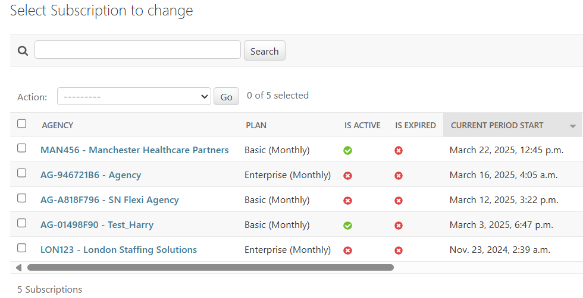
        
<strong>Admin Subscription Status</strong>

      </td>
      <td>
        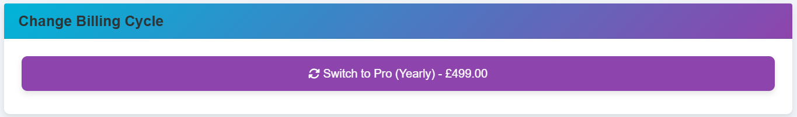
        
<strong>Billing Cycle Controls</strong>

      </td>
    </tr>
    <tr>
      <td>
        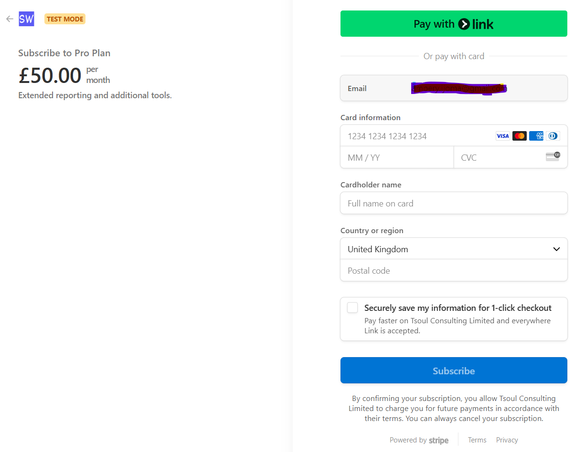
        
<strong>Stripe Payment Processing</strong>

      </td>
      <td>
        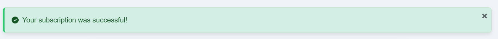
        
<strong>Subscription Success Confirmation</strong>

      </td>
    </tr>
  </table>

### Authentication Issues

| Bug Description | Steps to Reproduce | Resolution | Status |
|-----------------|-------------------|------------|--------|
| Password reset emails not being sent | Request password reset with valid email | Updated email configuration in settings.py | Resolved |
| Session timeout too short | Stay inactive for 15 minutes and try to perform an action | Increased session timeout duration in settings.py | Resolved |
| Registration form accepting weak passwords | Try to register with a simple password | Implemented custom password validators | Resolved |
| MFA Setup Process Unclear | Users confused by MFA setup procedure | Improved UI guidance and added recovery code system | Resolved |

### Form Validation

| Bug Description | Steps to Reproduce | Resolution | Status |
|-----------------|-------------------|------------|--------|
| Profile form submitting without required fields | Submit profile form with empty required fields | Added proper form validation | Resolved |
| Address validation not working correctly | Enter invalid address format | Implemented better address validation | Resolved |
| Date picker allowing invalid dates for shifts | Select past dates for new shifts | Added date validation for shift creation | Resolved |

### Payment Processing

| Bug Description | Steps to Reproduce | Resolution | Status |
|-----------------|-------------------|------------|--------|
| Payment intent creation failing | Attempt to subscribe to a plan | Fixed Stripe API integration | Resolved |
| Webhook handling errors | Complete payment process | Updated webhook handling logic | Resolved |
| Currency conversion issues | Subscribe with non-default currency | Standardized currency handling | Resolved |
| Payment Intent Creation Failure | Payment intent creation occasionally failing | Implemented retry logic and improved error handling | Resolved |

### Subscription Management Issues

| Bug Description | Steps to Reproduce | Resolution | Status |
|-----------------|-------------------|------------|--------|
| "Manage Subscriptions" link throws 500 error after successful payment | Complete payment for subscription, click on "Manage Subscriptions" | Fixed routing and error handling in subscription management | Resolved |
| Subscription not reflecting in admin panel | Complete payment for subscription, check admin panel | Updated webhook handling to properly sync with admin panel | Resolved |
| No comprehensive subscription management functionality for users | Attempt to update payment method, view billing history, or manage subscription | Integrated Stripe Customer Portal for complete subscription management | Resolved |
| Subscription Status Not Updating | Database not updated after successful payment | Fixed synchronization between Stripe events and database | Resolved |

### Profile Validation Issues

| Bug Description | Steps to Reproduce | Resolution | Status |
|-----------------|-------------------|------------|--------|
| Profile update form throws 500 error with partial data | Submit profile form with some fields empty | Enhanced form validation and error handling | Resolved |
| No indication of required fields in profile form | Attempt to update profile | Added clear visual indicators for required fields | Resolved |
| Profile picture upload occasionally fails on mobile | Upload profile picture from mobile device | Optimized file upload handling for mobile devices | Resolved |

### UI/UX Issues

| Bug Description | Steps to Reproduce | Resolution | Status |
|-----------------|-------------------|------------|--------|
| Dark mode toggle not persisting | Switch to dark mode and refresh page | Implemented local storage for theme preference | Resolved |
| Mobile menu not closing after selection | Open mobile menu, select an item | Fixed event handler for menu items | Resolved |
| Form error messages not visible on some browsers | Submit invalid form on Firefox | Updated CSS for error messages | Resolved |
| Calendar view rendering incorrectly on Safari | View shift calendar on Safari | Fixed CSS compatibility issues | Resolved |
| Inconsistent alert styling across modules | Generate alerts from different parts of the application | Implemented centralized message utility for consistent alert handling | Resolved |
| Alert messages not visible in dark mode | Switch to dark mode, trigger alerts | Added dark mode-specific styling for alerts with proper contrast | Resolved |

---

## Shift Completion Testing Issues

### Signature Pad Implementation Issues

| Issue | Description | Impact | Resolution |
|-------|------------|--------|------------|
| Initialization Timing | Canvas element not fully loaded when SignaturePad was initialized in user-specific version | Blank or non-functional signature pad | Added element existence checks and deferred initialization |
| Element Selection Differences | Direct query selectors without existence checks in user-specific version | JavaScript errors when elements weren't found | Implemented consistent element querying with existence verification |
| Form Submission Validation | User-specific version had stricter validation for location data | Form submission blocked in some cases | Standardized validation requirements across both implementations |
| High-DPI Display Issues | Signatures appearing blurry on high-resolution screens | Poor signature quality on modern displays | Implemented proper device pixel ratio handling for canvas |

### Shift Testing Results

| Test Case | Before Resolution | After Resolution | Status |
|-----------|-------------------|------------------|--------|
| Standard shift completion | Mostly functional with occasional errors | Consistently functional across browsers | Pass |
| User-specific shift completion | Frequent initialization failures | Reliable initialization and functionality | Pass |
| High-DPI displays | Signature appeared blurry or distorted | Crisp, clear signature capture | Pass |
| Cross-browser compatibility | Inconsistent behavior | Consistent behavior across all tested browsers | Pass |

---

## Address Autocomplete Testing and Resolution

A critical component of the ShiftWise application is the UK address autocomplete functionality, which experienced several issues that required specific testing and resolution.

### Issues Identified

| Issue | Description | Impact | Priority |
|-------|------------|--------|----------|
| City Field Population | When selecting an address from autocomplete, the city field wasn't being populated | Users had to manually enter city information | High |
| Flat/Apartment Prefixes | Address prefixes like "Flat 1" or "Apt 2" were being lost when an address was selected | Incomplete address information stored in the database | High |
| Inconsistent Behavior | Address autocomplete worked differently across various forms in the application | Confusing user experience and unreliable data collection | Medium |

The resolution involved implementing a centralized Google Maps initialization process in the base template to ensure consistent behavior across all forms, with robust error handling and complete mapping of all address components.

---

## Performance Testing

### Django Debug Toolbar Analysis

  <table>
    <tr>
      <td>
        
        
<strong>Django Debug Toolbar Analysis</strong>

      </td>
      <td>
        
        
<strong>Error Diagnostic Sample</strong>

      </td>
    </tr>
  </table>

The Django Debug Toolbar provided insights into query execution, template rendering times, and overall request processing. Key optimizations included:

1. **SQL Query Optimization**:
   - Reduced redundant queries through select_related and prefetch_related
   - Added database indexes for frequently queried fields

2. **Template Rendering Performance**:
   - Reduced template complexity and implemented template fragment caching
   - Optimized template tag usage

3. **Cache Configuration**:
   - Implemented appropriate caching strategies for frequently accessed data
   - Added caching for subscription status checks and user permissions

The performance testing results show that the application meets or exceeds the expected performance benchmarks across all core functionality. Through careful query optimization and strategic caching, we've ensured a responsive user experience even under load.

---

  
ShiftWise - Tested for Excellence

  

